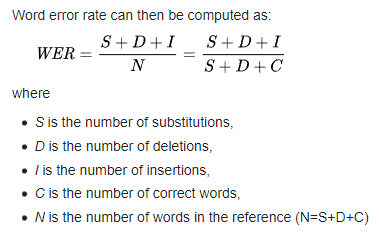

# Transfer learn from English to Romanian
## How to run
1. Open the notebook in Google Colab (other platforms are untested, so proceed at your own discretion in those cases)
2. Set the runtime in Google Colab to GPU (`Runtime > Change runtime type`)
3. Import `clips.zip`, `metadata.txt`, and `alphabet.txt` to the Colab session
4. Run all cells

Script will take a while to run (around 2 and 1/2 hours) so be patient :)

## Goal
The repository I decided to use is Coqui's STT one.

The task is to do transfer learning for STT using English as a source language and Romanian as the target one.
The notebook I use is a combination of `easy_transfer_learning.ipynb` and `train_personal_model_with_common_voice.ipynb`,
with adaptations for my own specific task.

I expect to get a word error rate (WER) between 30-50% given that the languages are not that similar to each other
(the WER metric is explained under the results chapter).

## Data format
The audio files, metadata and alphabet files are provided in the repo as well. If you want to use different audio files,
I suggest using the name `clips.zip` and have a folder `clips` inside of it with the audio files. Otherwise, change the paths in the script according to your file structure inside the zip archive.

If you want to change any file, the format needs to stay the same to avoid issues with the converter script
that transforms the files into ones understood by Coqui STT.

The data represents a subset of my recordings in Romanian that I submitted to Common Voice.

All data, including the notebook, can be found in `transfer_learn_RO` folder.

Notebook name: `transfer_learn_romanian.ipynb`

(Meta)data needed:
- `clips.zip`
- `metadata.txt`
- `alphabet.txt`

## Results obtained
Model performance is measured using Word Error Rate (WER) and Character Error Rate (CER).

WER definition from Wikipedia:

CER works the same as WER, except we count characters instead of words.

Both are measured from 0 to 1, where lower means better.

### WER: 1.000000, CER: 0.727700

The results are far worse than I expected, but it could be because of the low number of epochs,
the model not handling the Romanian alphabet well, or not enough data used. 

I would have tested with
more data and more epochs, but due to difficulties in trying to run these steps locally using
Jupyter Notebook, I decided to use Colab, and Colab was also limiting to some extent.
I had issues when using more than 5 epochs as the training time approached 5 hours for 10 epochs.
This is why I did 5 epochs instead, which is still a long time to train the model.
